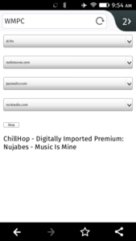

Very basic web mpd client
==================================

This is a very basic web client to control MPD on a server. It does so by executing shell commands using the PHP function `shell_exec()` executing the shell commands `mpc ls`, `mpc play` and `mpc stop` to control MPD.

As I hardly ever listen to anything else than di.fm and sibling sites, the client only handles those stream playlists, that I downloaded using [this script](http://mpd.wikia.com/index.php?title=Hack:di.fm-playlists).

Disclaimer: I know there are tons of software projects called WMPC. Feel free to fork and rename it.

This software is released under the [WTFPL](http://www.wtfpl.net/).

